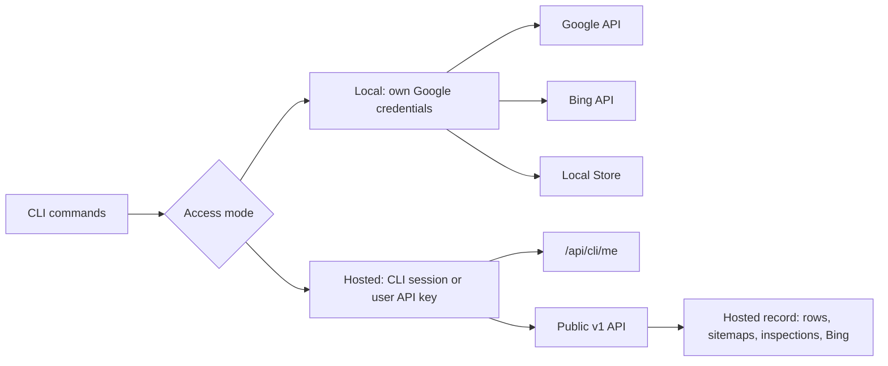

# Architecture

`gscdump` is a pnpm monorepo. This document is the high-level map; per-package
READMEs and the root `AGENTS.md` carry the operational detail.

## Monorepo Layout

```
.
├── package.json             # root workspace config
├── pnpm-workspace.yaml      # workspace + catalog definitions
├── tsconfig.json            # root TS project references
├── packages/
│   ├── gscdump/              # gscdump: edge-safe REST client + query builder
│   ├── engine/               # @gscdump/engine: Parquet/DuckDB storage, planner, adapters
│   ├── engine-duckdb-wasm/   # @gscdump/engine-duckdb-wasm: DuckDB-WASM runtime adapter
│   ├── engine-sqlite/        # @gscdump/engine-sqlite: SQLite runtime adapter
│   ├── engine-gsc-api/       # @gscdump/engine-gsc-api: live GSC API source adapter
│   ├── analysis/             # @gscdump/analysis: analyzers + reports + source dispatch
│   ├── contracts/            # @gscdump/contracts: hosted API contracts
│   ├── sdk/                  # @gscdump/sdk: hosted API HTTP clients
│   ├── cloudflare/           # @gscdump/cloudflare: Cloudflare Workers / R2 helper primitives
│   ├── lakehouse/            # @gscdump/lakehouse: dataset-agnostic Iceberg catalog + registry
│   └── cli/                  # @gscdump/cli: CLI (dump, query, sync, analyze, report) + bundled MCP server
├── examples/
│   └── nuxt-dashboard/       # Example Nuxt dashboard app
└── tooling & config (eslint, tsconfig, vitest, scripts)
```

## Package Dependencies

- `@gscdump/contracts` → `zod`
- `gscdump` → `@gscdump/contracts`
- `@gscdump/lakehouse` → no runtime dependencies
- `@gscdump/engine` → `gscdump`, `@gscdump/contracts`, `@gscdump/lakehouse`
- `@gscdump/engine-duckdb-wasm` → `gscdump`, `@gscdump/contracts`, `@gscdump/engine`
- `@gscdump/engine-sqlite` → `@gscdump/engine`
- `@gscdump/engine-gsc-api` → `gscdump`, `@gscdump/engine`
- `@gscdump/analysis` → `gscdump`, `@gscdump/engine`, `@gscdump/engine-gsc-api`
- `@gscdump/cloudflare` → `gscdump`, `@gscdump/contracts`, `@gscdump/engine`, `@gscdump/engine-sqlite`
- `@gscdump/cli` → `gscdump`, `@gscdump/engine`, `@gscdump/engine-gsc-api`, `@gscdump/analysis`, `@gscdump/sdk`
- `@gscdump/sdk` → `gscdump`, `@gscdump/contracts`, `@gscdump/engine`, `@gscdump/analysis`

The graph is acyclic. Contracts and Lakehouse are the lowest internal layers;
runtime adapters build on Engine, while SDK and CLI compose public surfaces.

## CLI access modes

The CLI has 2 access modes: Local and Hosted.
`packages/cli/src/auth-state.ts` resolves the mode for the current profile with `resolveAccessMode`.
The command's `--mode` overrides `GSCDUMP_AUTH_MODE`, which overrides the saved mode.
If no mode is saved, `GSCDUMP_API_KEY` selects Hosted mode.
With neither source, the CLI uses Local mode.
Local credentials remain separate for Google and Bing.



Local mode calls Google with the user's own service account or OAuth client. It never uses gscdump.com for Google login or token refresh.
Hosted reads use the hosted record. `indexing inspect --yes` requests new Google URL Inspections through the platform.
The platform reserves the shared daily quota before calling Google. The CLI sends one request and never retries it automatically.
`context.ts` builds the Google client in Local mode only. In Hosted mode, `needsAuth` throws `LOCAL_MODE_REQUIRED`.
`hosted-query.ts` reads hosted rows through the public v1 `analytics.rows.query` operation.
`bing-hosted.ts` and `hosted-site.ts` use `@gscdump/sdk/v1` for hosted Bing, sitemap, and URL Inspection reads.
`bing-auth.ts` resolves local Bing credentials and refreshes OAuth tokens before requests.

Store queries and exports read local files in either mode.
Bing dumps export provider rows or saved hosted datasets directly. They do not populate the Google Store.
Every command that calls Google needs Local mode: sync, URL Inspection, live queries, Indexing API, Site Verification, and the CLI MCP server.

## Data Flow

### Sync (write path)

```
GSC API → fetchSearchAnalyticsAll (gscdump)
        → transformGscRow / RowAccumulator (@gscdump/engine ingest)
        → Sink (in-memory | Iceberg append)
        → Iceberg data/catalog (@gscdump/lakehouse)
```

### Query (read path)

```
gsc() query builder (gscdump/query)
        → BuilderState → compileLogicalQueryPlan (@gscdump/engine planner)
        → resolveToSQL (@gscdump/engine resolver)
        → DuckDB (WASM | node), R2 SQL, or SQLite over resolved files/tables
        → typed rows
```

### Analyze

```
rows → analyzer (@gscdump/analysis)
     → AnalyzerResult (metrics, findings, series)
```

## Runtime Targets

| Package | Node | Browser | Workerd |
| --- | --- | --- | --- |
| `gscdump` | ✅ | ✅ | ✅ |
| `@gscdump/engine` (core) | ✅ | ✅ | ✅ |
| `@gscdump/engine/node` | ✅ | ❌ | ❌ |
| `@gscdump/engine/sink-node` | ✅ | ❌ | ❌ |
| `@gscdump/engine-duckdb-wasm` | ✅ | ✅ | ⚠️ |
| `@gscdump/engine-sqlite` | ✅ | ✅ | ✅ |
| `@gscdump/engine-gsc-api` | ✅ | ✅ | ✅ |
| `@gscdump/analysis` | ✅ | ✅ | ✅ |
| `@gscdump/lakehouse` | ✅ | ✅ | ✅ |
| `@gscdump/sdk` | ✅ | ✅ | ✅ |
| `@gscdump/cloudflare` | ⚠️ | ❌ | ✅ |
| `@gscdump/cli` | ✅ | ❌ | ❌ |

## Key Design Decisions

See `docs/adr/` for the full set. Highlights:

- **Browser engine uses attached tables** (ADR-0001): DuckDB-WASM reads Parquet
  via `parquet_scan` over HTTP range requests, no full download.
- **Analysis re-exports engine contracts** (ADR-0002): one import surface for
  consumers; `@gscdump/analysis` is the public analyzer API.
- **execute-sql is method presence** (ADR-0003): capability detection by probing
  for the method, not a flag.
- **Analyzer registration is consumer-owned** (ADR-0004): Nuxt consumers import
  their registry statically, with no published Nuxt integration package.
- **Export surface tracks the two consumers** ([export surface decision](./docs/adr/0012-export-surface-tracks-consumers.md)): subpaths exist only
  where `gscdump.com` or `nuxtseo.com` import them; internal wiring stays private.

## MCP Server

The MCP server lives inside `@gscdump/cli` (`src/mcp/`), exposed through the
`gscdump mcp` command. Each tool call resolves the selected CLI authentication and constructs its Google client.
There is no separate
`@gscdump/mcp` package. MCP tools: `list-reports`, `run-report`, `list-sites`,
`inspect-url`, `batch-inspect`, `request-indexing`, `list-sitemaps`,
`get-indexing-status`. Handler signature is
`(args, context) => Promise<CallToolResult>`.
MCP exposes Google tools. Agents run Bing operations through `gscdump bing` commands and the packaged skill.

## Testing

- Unit/integration: `vitest` (`pnpm test`).
- Real-runtime workers: `pnpm test:workers` (Cloudflare workerd pool).
- Browser/OPFS: `pnpm test:browser` (chromium).
- E2E: `pnpm test:e2e` (skips live Google calls without BYOK env).

## Where Things Live

| Concern | Location |
| --- | --- |
| REST client, query builder | `gscdump` |
| Storage, planner, resolver, adapters | `@gscdump/engine` |
| Analyzers, reports | `@gscdump/analysis` |
| Hosted API contracts | `@gscdump/contracts` |
| Hosted API HTTP clients | `@gscdump/sdk` |
| Iceberg catalog, schema derivation, dataset registry | `@gscdump/lakehouse` |
| Cloudflare/R2 primitives | `@gscdump/cloudflare` |
| CLI commands + MCP server | `@gscdump/cli` |

## Conventions

- Packages ship ESM only (`"type": "module"`).
- Build with `obuild` (rolldown). Type checks with `tsc --noEmit`.
- Tests with `vitest`. Real-runtime tests via Cloudflare/browser pools.
- Catalog versions in `pnpm-workspace.yaml`; packages reference `catalog:`.

## See Also

- `docs/adr/` — architecture decision records.
- per-package `README.md` — package-level detail.
- root `AGENTS.md`: agent operational rules.
