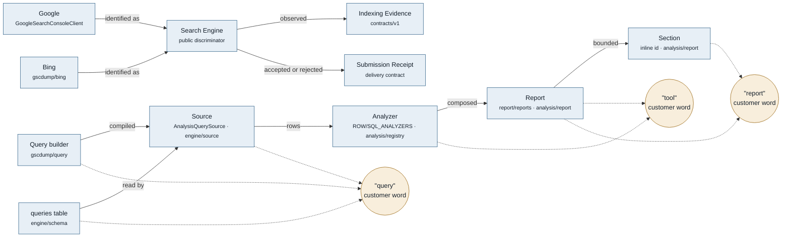

# Glossary

Canonical vocabulary for this project. Every user-visible string, public API
name, doc heading, and route segment uses these terms and no synonyms.

**Provenance.** This file does not start from zero. `CONTEXT.md` §Language already
holds a ratified 25-term vocabulary with an `_Avoid_` line per term, a
`## Relationships` section, and a `## Flagged ambiguities` section. That list is
the parent of this one and its wording is cited, not overridden. This file adds
what `CONTEXT.md` does not cover: the **customer surface** (CLI command and flag
names, MCP tool names, analyzer/report ids, package and subpath export names,
README and docs headings), and the places where that surface contradicts the
internal vocabulary. Two competing lists is the worst outcome here — see
Open question 1 for how to collapse them.

## Map

| Term | Table / module | Owner | Cardinality | Customer word |
| --- | --- | --- | --- | --- |
| Site | (no table; `siteId` string key) | `gscdump/tenant` | Team 1—N Site (hosted); Auth 1—N Site (CLI) | "property" (README, docs), "site" (`--site`, `siteUrl`) |
| Search Engine | `GoogleSearchConsoleClient`; `gscdump/bing` | `gscdump`, `@gscdump/contracts` | Site 1—N Search Engine | "Google" or "Bing" |
| Indexing Evidence | `gscdump/api/indexing`; `gscdump/bing`; `@gscdump/contracts/v1` | `gscdump`, `@gscdump/contracts` | (Site, URL, Search Engine) 1—N observation | "indexing evidence" |
| Submission Receipt | deferred delivery contract in `@gscdump/contracts/v1` | `@gscdump/contracts` | Submission 1—1 Submission Receipt | "submission receipt" |
| Team | `gscdumpTeamRowSchema` | `contracts/partner` | Team 1—N Site | "team" |
| Engine | `packages/engine` + 3 adapters | `@gscdump/engine` | Engine 1—1 Driver | not surfaced |
| Driver | (runtime handle) | `@gscdump/engine` | — | not surfaced |
| Source | `AnalysisQuerySource` | `engine/source` | Engine 1—N Source | not surfaced |
| Adapter | `ResolverAdapter` | `engine/resolver`, `engine-sqlite/resolver` | Source 1—1 Adapter | not surfaced |
| Analyzer | `ROW_ANALYZERS`/`SQL_ANALYZERS` | `analysis/registry` | Report 1—N Analyzer | "tool" (`analyze <tool>`, README table header) |
| Report | `report/reports/*` | `analysis/report` | Report 1—N Section | "report" (`gscdump report`, `run-report`) |
| Section | inline `id:` in each report | `analysis/report` | Section 1—1 Analyzer run | "finding" / section id in `ReportResult` |
| Rollup | `u_<u>/<s>/rollups/<id>` | `engine/rollups` | Site 1—N Rollup | "rollup" (`store rollups`) |
| Entity | per-site entity stores | `engine/entities` | Site 1—N Entity | not surfaced |
| Canonical Query | `query_canonical` | `analysis` (`normalizeQuery`) | Query N—1 Canonical Query | not surfaced |
| Query Dimension | `query_dim` | `engine/entities` | Site 1—1 Query Dimension | not surfaced |
| Manifest authority | `ManifestStore` / R2 HEAD pointer | `engine` | (siteId, table, searchType) 1—1 Manifest | not surfaced |
| Sitemap generation manifest | hosted entity store | `contracts` (ADR-0022) | Site 1—1 current generation | "sitemap" |
| Store | `.data/` parquet dir | `@gscdump/cli` | Site 1—1 Store | "store" (`gscdump store *`) |

Collisions
  "query"       four things: the `query` CLI command, the `query` MCP tool, the `queries`
                fact table / `query` dimension column, and the `gscdump/query` builder subpath
  "report"      the `report` CLI command, `run-report` MCP tool, `@gscdump/engine/report`
                and `@gscdump/analysis/report` exports, and `ReportResult` — while
                `CONTEXT.md` line 41 bans "report" as a synonym for Analyzer
  "tool"        README §Analyzers heads its column `Tool` and the CLI takes
                `analyze <tool>`, while `CONTEXT.md` line 41 bans "tool" for Analyzer;
                separately "tool" is the MCP protocol noun for `run-report`/`query`
  "brand", "movers"  each is simultaneously an Analyzer id and a Report id in what
                looks to a caller like one flat id namespace
  "site" / "property"  same concept; "property" in README and docs prose, "site"
                in every identifier, flag, and package name
  "store"       a CLI command group and a package concept, while `CONTEXT.md`
                line 15 bans "store" as a synonym for Engine

## Terms

### Search Engine
**Is:** Google or Bing as the origin of Indexing Evidence.
**Use for:** the `searchEngine` discriminator in public contracts, schemas, Operations, and SDK methods.
**Never:** Engine, Source, or provider as a public discriminator. Engine and Source retain their existing package meanings. Provider remains internal adapter vocabulary.
**Casing:** `Search Engine` in prose, `searchEngine` in identifiers, lowercase values `google` and `bing`.
**Ratified by:** gscdump.com ADR-0008.

### Indexing Evidence
**Is:** one dated observation about one URL from one Search Engine, including its freshness and uncertainty.
**Use for:** Search-Engine-labelled URL discovery, crawl, origin-response, and supported verdict observations.
**Never:** indexing status, combined status, cross-engine verdict, coverage answer.
**Casing:** `Indexing Evidence` in prose, `indexingEvidence` in identifiers.
**Ratified by:** gscdump.com ADR-0008.

### Submission Receipt
**Is:** proof that a change notification was accepted or rejected.
**Use for:** a later IndexNow delivery contract and immutable delivery records.
**Never:** Indexing Evidence, indexed verdict, submission evidence, acknowledgement.
**Casing:** `Submission Receipt` in prose, `submissionReceipt` in identifiers.
**Ratified by:** gscdump.com ADR-0008.

### Analyzer
**Is:** the pure `{ id, requires, build, reduce }` contract in `@gscdump/analysis`;
one unit of analysis over rows or SQL. Definition inherited from `CONTEXT.md` line 39.
**Use for:** `ROW_ANALYZERS`/`SQL_ANALYZERS` members, `runAnalyzerFromSource`,
the `@gscdump/analysis/registry` export.
**Never:** report, query. Note "tool" is contested — see Open question 2.
**Casing:** `Analyzer` in prose, `analyzer` in identifiers, kebab-case ids (`striking-distance`).

### Report
**Is:** an intent-keyed composition of Analyzers returning a `ReportResult` of
bounded Sections plus next steps.
**Use for:** the `gscdump report` command, the `list-reports`/`run-report` MCP tools,
`@gscdump/analysis/report`, the nine ids in README §Reports.
**Never:** analysis run, digest, summary, audit.
**Casing:** `Report` in prose, `report` in identifiers, kebab-case ids (`pre-publish`).

### Section
**Is:** one bounded block of findings inside a `ReportResult`, carrying its own
`id` (`low-ctr`, `decliners`, `striking-peers`, `brand-split`, `cannibalization-risk`).
**Use for:** the `id:` field on entries inside `report/reports/*`.
**Never:** finding-group, block, panel, sub-report.
**Casing:** `Section` in prose, kebab-case ids. See Open question 3: these ids share
a spelling space with Analyzer and Report ids and are not documented anywhere public.

### Site
**Is:** one Google Search Console property, keyed by `siteId` / `siteUrl`
(`sc-domain:example.com` or `https://example.com/`).
**Use for:** `--site`, `siteUrl` in every MCP tool input, `site_id` in the
SQLite multi-tenant path, `gscdump/tenant`, the `sites` CLI command.
**Never:** domain, host, tenant (Team is the tenant), account.
**Casing:** `Site` in prose, `site` in identifiers and flags. "property" currently
appears in customer prose — see Open question 4.

### Store
**Is:** the local append-only Parquet/DuckDB directory the CLI reads and writes.
**Use for:** the `gscdump store *` command group, `--live` as its opposite.
**Never:** database, cache, warehouse, local db.
**Casing:** `store` in commands, `Store` in prose. Conflicts with the
`CONTEXT.md` line 15 ban — see Open question 5.

### Engine / Driver / Source / Adapter / Rollup / Entity / Canonical Query / Query Dimension / Manifest authority
**Is:** defined verbatim in `CONTEXT.md` §Language (lines 13—107). Not restated here
to avoid a second copy drifting from the first. Their `_Avoid_` lines are the
authoritative `Never:` lines until Open question 1 is resolved.

## Banned

Every candidate ban below was checked against stored enum values, column names,
public export paths, and the ADR log before being listed. Words that survive that
check are banned; words that did not are recorded in Open questions instead.

| Never | Use instead | Why |
| --- | --- | --- |
| keyword (as the stored noun) | query | `queries` is the table and `query` is the GSC dimension; "keyword" is fine in marketing prose only |
| local db, warehouse, database | Store | The CLI concept is a parquet directory, not a server |
| GSC account | Site or Team | "account" collides with Google account vs partner Team |
| bare `engine` or `source` as a public search discriminator | Search Engine | Both words already name package concepts |
| indexing status as a public evidence noun | Indexing Evidence | It collides with pipeline state and hides observation uncertainty |
| powerful, seamless, robust, blazing | (cut) | Marketing filler |

**Bans rejected by the schema/export check** (do not add these):

| Rejected ban | Blocked by |
| --- | --- |
| ~~registry~~ | ADR-0021 ratifies "dataset registry"; `@gscdump/analysis/registry` is a published export |
| ~~cache~~ | ADR-0014 title ratifies "pluggably cached"; `contracts/file-resolution` uses it |
| ~~store~~ | `gscdump store` is a published CLI command group |
| ~~backend~~ | ADR-0012 title ratifies "Iceberg backend" |
| ~~snapshot~~ | Live in `contracts/file-resolution` and `v1/operations`, and in the ratified Manifest-authority definition |
| ~~generation~~ | ADR-0022 makes "generation" the sitemap manifest noun |
| ~~hash~~ | "membership hash" / "payload hash" are `CONTEXT.md` terms in their own right |
| ~~client~~ | `GoogleSearchConsoleClient` and the `@gscdump/sdk` hosted clients are public exports |
| ~~index~~ | The Indexing API, `inspect-url`, and `get-indexing-status` are public |
| ~~tag~~ | `kind` is documented as a telemetry tag |

## Open questions

Naming calls this file does not settle. Resolve one, fold the answer in, delete the entry.

1. **Where does the vocabulary live: `CONTEXT.md` or `GLOSSARY.md`?**
   `CONTEXT.md` line 3 declares its §Language section "load-bearing across
   packages" and carries 25 terms with `_Avoid_` lines, a Relationships list,
   and a Flagged-ambiguities list. This file now carries a Map and a customer
   surface `CONTEXT.md` never had. Two lists is exactly the failure this file
   exists to prevent.
   - Move §Language, §Relationships, §Flagged ambiguities into `GLOSSARY.md`;
     leave `CONTEXT.md` a one-line pointer. Touches `CLAUDE.md` line 5, which
     routes agents to `CONTEXT.md` for "architecture language".
   - Keep `CONTEXT.md` authoritative for internal terms and scope this file to
     the customer surface only. Cheapest, but a reader must open two files and
     the boundary will erode.
   - Delete this file and extend `CONTEXT.md` with a Map and a customer-word
     column. Keeps one file; loses the `GLOSSARY.md` convention other repos use.

2. **Is "tool" a banned synonym for Analyzer, or the public name for one?**
   `CONTEXT.md` line 41 bans it. README line 80 heads the analyzer table `Tool`
   and the CLI signature is `gscdump analyze <tool>`. Separately, MCP uses "tool"
   as its own protocol noun for `run-report` and `query`, so the word is
   unavoidable in the AI-integration docs.
   - Keep the ban, rename the README column to `Analyzer` and the CLI arg to
     `<analyzer>`. Breaking change to a published CLI signature.
   - Narrow the ban to prose and identifiers, and accept `<tool>` as the frozen
     CLI arg name. Leaves one customer-facing counterexample to the rule.
   - Drop the ban, make "tool" the customer word and "Analyzer" the internal one,
     recorded as a deliberate surface crossing.

3. **Do Analyzer ids, Report ids, and Section ids share one namespace?**
   They are all bare kebab-case `id:` fields. `brand` and `movers` are each both
   an Analyzer id and a Report id. `opportunity` (Analyzer) sits beside
   `opportunities` (Report). Section ids `low-ctr`, `decliners`, `striking-peers`,
   `brand-split`, `cannibalization-risk` appear in no public doc, so a caller
   reading a `ReportResult` cannot tell which kind of id they hold.
   - Prefix at the type level (`analyzer:brand`, `report:brand`). Wire-visible change.
   - Rename the colliding Report ids (`brand` → `brand-share`, `movers` →
     `movement`). Changes documented MCP `run-report` arguments customers copy from README.
   - Document that they are three namespaces and never compared, add the Section
     id list to README. No code change; relies on readers.

4. **"Property" or "Site" in customer-facing prose?**
   README line 63 and `docs/guides/historical-database.md` line 29 say "GSC
   properties"; `docs/guides/ai-integration.md` line 45 says "Search Console
   properties". Every flag, schema field, MCP input, and package name says site.
   "Property" is Google's own word, so it is what the customer already knows.
   - Standardise on Site everywhere including prose. One word, contradicts Google's UI.
   - Keep "property" in prose as a deliberate crossing, recorded in the Map.
     Requires the glossary to permit one documented synonym.
   - Say "site (GSC property)" on first use per document, "site" after.

5. **Does `gscdump store` invalidate the `store` ban, or should the command be renamed?**
   `CONTEXT.md` line 15 bans "store" as a synonym for Engine. But `store` is a
   published CLI command group with five subcommands (`stats`, `compact`, `gc`,
   `export`, `rollups`) and `.data/` is genuinely a store, not an Engine.
   - Narrow the ban to "not a synonym for Engine" and add Store as a term in its
     own right (drafted above). No code change.
   - Rename the command group (`gscdump data *`, `gscdump local *`). Breaks a
     published CLI surface for a wording rule.

6. **Is `sitemapd` a term, a package name, or both?**
   `CONTEXT.md` line 51 defines "Sitemap document reader (`sitemapd`)" as "the
   canonical source-only parser and traversal package", but no `packages/sitemapd`
   directory exists in this repo and no workspace package is named `sitemapd`.
   Either it lives in another repo, it was renamed, or the term is aspirational.
   - Confirm it is external and mark the term as naming a cross-repo package.
   - It was folded into `gscdump/sitemap-identity`; retire the term.
   - It is planned; move the entry to `ROADMAP.md` until it exists.

7. **Two ADRs are numbered 0012.**
   `docs/adr/0012-export-surface-tracks-consumers.md` and
   `docs/adr/0012-iceberg-backend-seam-and-edge-node-split.md`. Not a vocabulary
   question, but the decision log is cited as authority throughout this file and
   an ambiguous ADR reference makes those citations unverifiable.
   - Renumber the later one to 0023.
   - Cite ADRs by slug rather than number everywhere.
