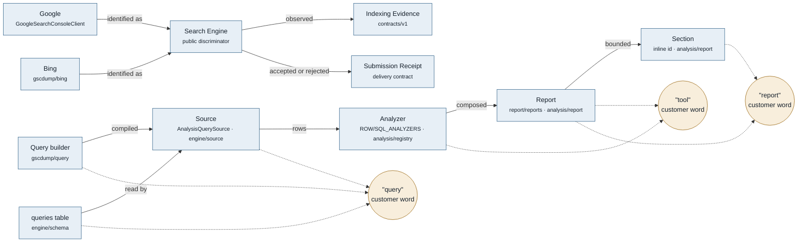

# Glossary

This file owns product vocabulary across packages, commands, documentation, and public contracts.
The internal definitions below were moved from `CONTEXT.md` without changing their meaning.
Public command names and stored identifiers keep their existing meanings.

## Map

| Term | Table / module | Owner | Cardinality | Customer word |
| --- | --- | --- | --- | --- |
| Site | (no table; `siteId` string key) | `gscdump/tenant` | Team 1—N Site (hosted); Auth 1—N Site (CLI) | "property" (README, docs), "site" (`--site`, `siteUrl`) |
| Search Engine | `GoogleSearchConsoleClient`; `gscdump/bing` | `gscdump`, `@gscdump/contracts` | Site 1—N Search Engine | "Google" or "Bing" |
| Indexing Evidence | `gscdump/api/indexing`; `gscdump/bing`; `@gscdump/contracts/v1` | `gscdump`, `@gscdump/contracts` | (Site, URL, Search Engine) 1—N observation | "indexing evidence" |
| Submission Receipt | deferred delivery contract in `@gscdump/contracts/v1` | `@gscdump/contracts` | Submission 1—1 Submission Receipt | "submission receipt" |
| Team | `gscdumpTeamRowSchema` | `contracts/partner` | Team 1—N Site | "team" |
| Engine | `packages/engine` + 3 adapters | `@gscdump/engine` | Engine 1—1 Driver | not surfaced |
| Driver | (runtime handle) | `@gscdump/engine` | — | not surfaced |
| Source | `AnalysisQuerySource` | `engine/source` | Engine 1—N Source | not surfaced |
| Adapter | `ResolverAdapter` | `engine/resolver`, `engine-sqlite/resolver` | Source 1—1 Adapter | not surfaced |
| Analyzer | `ROW_ANALYZERS`/`SQL_ANALYZERS` | `analysis/registry` | Report 1—N Analyzer | "tool" (`analyze <tool>`, README table header) |
| Report | `report/reports/*` | `analysis/report` | Report 1—N Section | "report" (`gscdump report`, `run-report`) |
| Section | inline `id:` in each report | `analysis/report` | Section 1—1 Analyzer run | "finding" / section id in `ReportResult` |
| Rollup | `u_<u>/<s>/rollups/<id>` | `engine/rollups` | Site 1—N Rollup | "rollup" (`store rollups`) |
| Entity | per-site entity stores | `engine/entities` | Site 1—N Entity | not surfaced |
| Canonical Query | `query_canonical` | `analysis` (`normalizeQuery`) | Query N—1 Canonical Query | not surfaced |
| Query Dimension | `query_dim` | `engine/entities` | Site 1—1 Query Dimension | not surfaced |
| Manifest authority | `ManifestStore` / R2 HEAD pointer | `engine` | (siteId, table, searchType) 1—1 Manifest | not surfaced |
| Sitemap generation manifest | hosted entity store | `contracts` (ADR-0022) | Site 1—1 current generation | "sitemap" |
| Store | configured Parquet directory | `@gscdump/cli` | Site 1—1 Store | "store" (`gscdump store *`) |

## Usage

- Use Analyzer in prose. `<tool>` is the existing CLI positional label; MCP also uses the protocol noun "tool".
- Analyzer, Report, and Section IDs use separate namespaces. `brand` can name both an Analyzer and a Report.
- Use Site in prose. Explain it as a Google Search Console property when readers need the Google term.
- Store names the local Parquet directory. It is not a synonym for Engine.
- `sitemapd` is an external dependency, separate from `gscdump/sitemap-identity`.
- Cite full ADR filenames when two decisions share a number.

The two ADR-0012 decisions are
[export surface](./docs/adr/0012-export-surface-tracks-consumers.md) and
[Iceberg backend](./docs/adr/0012-iceberg-backend-seam-and-edge-node-split.md).

## Terms

### Search Engine
**Is:** Google or Bing as the origin of Indexing Evidence.
**Use for:** the `searchEngine` discriminator in public contracts, schemas, Operations, and SDK methods.
**Never:** Engine, Source, or provider as a public discriminator. Engine and Source retain their existing package meanings. Provider remains internal adapter vocabulary.
**Casing:** `Search Engine` in prose, `searchEngine` in identifiers, lowercase values `google` and `bing`.
**Ratified by:** gscdump.com ADR-0008.

### Indexing Evidence
**Is:** one dated observation about one URL from one Search Engine, including its freshness and uncertainty.
**Use for:** Search-Engine-labelled URL discovery, crawl, origin-response, and supported verdict observations.
**Never:** indexing status, combined status, cross-engine verdict, coverage answer.
**Casing:** `Indexing Evidence` in prose, `indexingEvidence` in identifiers.
**Ratified by:** gscdump.com ADR-0008.

### Submission Receipt
**Is:** proof that a change notification was accepted or rejected.
**Use for:** a later IndexNow delivery contract and immutable delivery records.
**Never:** Indexing Evidence, indexed verdict, submission evidence, acknowledgement.
**Casing:** `Submission Receipt` in prose, `submissionReceipt` in identifiers.
**Ratified by:** gscdump.com ADR-0008.

### Analyzer
**Is:** the pure `{ id, requires, build, reduce }` contract in `@gscdump/analysis`;
one unit of analysis over rows or SQL. The internal Analyzer contract has the same meaning.
**Use for:** `ROW_ANALYZERS`/`SQL_ANALYZERS` members, `runAnalyzerFromSource`,
the `@gscdump/analysis/registry` export.
**Never:** report, query, tool as a prose synonym. The CLI positional label `<tool>` remains supported.
**Casing:** `Analyzer` in prose, `analyzer` in identifiers, kebab-case ids (`striking-distance`).

### Report
**Is:** an intent-keyed composition of Analyzers returning a `ReportResult` of
bounded Sections plus next steps.
**Use for:** the `gscdump report` command, the `list-reports`/`run-report` MCP tools,
`@gscdump/analysis/report`, the eight IDs in README Reports.
**Never:** analysis run, digest, summary, audit.
**Casing:** `Report` in prose, `report` in identifiers, kebab-case ids (`pre-publish`).

### Section
**Is:** one bounded block of findings inside a `ReportResult`, carrying its own
`id` (`low-ctr`, `decliners`, `striking-peers`, `brand-split`, `cannibalization-risk`).
**Use for:** the `id:` field on entries inside `report/reports/*`.
**Never:** finding-group, block, panel, sub-report.
**Casing:** `Section` in prose, kebab-case IDs.
Analyzer, Report, and Section IDs use separate namespaces.

### Site
**Is:** one Google Search Console property, keyed by `siteId` / `siteUrl`
(`sc-domain:example.com` or `https://example.com/`).
**Use for:** `--site`, `siteUrl` in every MCP tool input, `site_id` in the
SQLite multi-tenant path, `gscdump/tenant`, the `sites` CLI command.
**Never:** domain, host, tenant (Team is the tenant), account.
**Casing:** `Site` in prose, `site` in identifiers and flags.
Use "Google Search Console property" only to explain the Google term for a Site.

### Store
**Is:** the local append-only Parquet/DuckDB directory the CLI reads and writes.
**Use for:** the `gscdump store *` command group, `--live` as its opposite.
**Never:** database, cache, warehouse, local db.
**Casing:** `store` in commands, `Store` in prose.
Store is a separate concept from Engine.

## Internal terms

### Storage & data

**Schema**:
The canonical drizzle pg-core tables in `@gscdump/engine/schema` (`pages`, `queries`, `countries`, `dates`, `page_queries`, search-appearance tables, and `hourly_pages`). Single source of truth; the parquet `SCHEMAS` map and the sqlite-core compatibility variant are derived from or drift-checked against it.
_Avoid_: tables, models, columns-as-source-of-truth.

**Engine**:
A storage runtime — DuckDB-Node, DuckDB-WASM, SQLite/D1, or GSC live-API — that produces a `Source` consumers can query. Distinct from the **Driver** it wraps.
_Avoid_: backend, store, datastore.

**Driver**:
The low-level runtime binding an **Engine** wraps: an `AsyncDuckDB` handle, a sqlite-proxy executor, an R2 bucket. Analyzers never see one.
_Avoid_: connection, client (overloaded).

### Query plumbing

**Source** (`AnalysisQuerySource`):
The query abstraction analyzers consume. Single interface; `queryRows` is always present and raw SQL is opt-in through method presence (`typeof source.executeSql === 'function'`). Capability flags advertise planner support (`regex`, `comparisonJoin`, `windowTotals`, `multiDataset`) and storage support (`attachedTables`, `fileSets`, `adapter`). The `kind` tag (`local | browser | live | in-memory | composite | attached-table`) is telemetry only — never used for routing. The deep seam between analyzers and engines.
_Avoid_: provider, repository, query service. Don't reintroduce a `RowQuerySource`/`SqlQuerySource` discriminated union or an `executeSql` capability flag; see ADR-0003.

**Adapter** (`ResolverAdapter<TableKey>`):
Dialect-specific translator that compiles `BuilderState` → `{ sql, params }` against a drizzle schema. Two real variants: `pgResolverAdapter` (DuckDB; single-tenant) and `sqliteResolverAdapter` (SQLite/D1; multi-tenant via `site_id`). Built via `createResolverAdapter`.
_Avoid_: compiler, translator, dialect.

**Archetype Query**:
Typed hosted analytics query contract exported from `@gscdump/contracts/archetypes`. Describes the finite server-tail/browser query shapes (`site-daily-timeseries`, `top-n-breakdown`, `arbitrary-sql`, etc.) and their execution class without owning transport or SQL execution.
_Avoid_: keeping or re-exporting archetype contracts from `@gscdump/sdk`; import them from their owner.

**Archetype SQL compiler**:
Server-tail compiler that turns an `ArchetypeQuery` into `{ sql, params, table }` with a `{{TABLE}}` placeholder. Runtime adapters substitute the concrete table reference; browser/WASM keeps its own compiler because attached partition bindings use a different contract.
_Avoid_: per-runtime server-tail SQL builders.

**Analyzer** (`Analyzer<P, R>`):
Pure contract `{ id, requires, build, reduce }`. Two families: `ROW_ANALYZERS` (against rows) and `SQL_ANALYZERS` (against `SqlQuerySource`). Dispatched by `runAnalyzerFromSource(source, params, registry)`.
_Avoid_: tool, report, query as prose synonyms. The CLI positional label `<tool>` is an existing interface label.

**Rollup** (`RollupDef`):
Post-sync aggregate written to `u_<u>/<s>/rollups/<id>__v<ts>.{json,parquet}`. Cheap reads, fixed shape. JSON for small widgets; parquet for server-side-filterable tables. The opt-in canonical-primary set (`CANONICAL_ROLLUPS`: `query_canonical_daily`, `query_canonical_variants`) is materialized from the **Query Dimension** and consumed via the read-path overlay seams. Distinct from analyzers, which run on demand.
_Avoid_: aggregate, summary, snapshot (collides with **Entity** snapshots).

**Entity**:
Per-site slow-changing state, point-lookup-by-id — URL inspections, sitemap snapshots, indexing-metadata events, the query dimension. Distinct family from time-series facts.
_Avoid_: record (overloaded), object.

**Sitemap document reader** (`sitemapd`):
The external `sitemapd` package owns sitemap parsing and traversal. It owns XML/robots parsing, decompression and byte limits, nested-index traversal, redirect handling, and caller-supplied target authorization. It does not persist sitemap state.
_Avoid_: app-local parser wrappers, importing framework sitemap modules to parse XML.

**Sitemap generation authority**:
The hosted gscdump.com entity store for one site's exact sitemap membership. A complete traversal stages immutable feed bases and events, then publishes one site manifest as the only visibility point. Readers pin to that manifest and its reachable ancestry.
_Avoid_: CLI-local sitemap snapshots, prefix scans that discover unreferenced objects, treating GSC's submitted-sitemap metadata as URL membership.

**Sitemap feed identity**:
The WHATWG-canonical absolute HTTP(S) document URL with its fragment removed. Scheme and host casing plus default ports normalize; path casing, query, and trailing slash remain identity-bearing. Cross-site traversal is explicit authorization at the `sitemapd` load boundary.
_Avoid_: `urlMatchKey`; it is an analytics grouping key and must never identify feeds or membership records.

**Sitemap product scoping** (`gscdump/sitemap-identity`):
Parser-free helpers for canonical same-site feed identity, duplicate evidence selection, and exact membership digests. This is a product policy seam distinct from `sitemapd` document authorization.
_Avoid_: moving XML parsing back into `gscdump` or using analytics URL normalization for identity.

**Sitemap membership hash** / **payload hash**:
Versioned exact hashes over a feed's effective records. Membership hashes include exact `loc` values. Payload hashes also include `lastmod`, so lastmod-only changes remain observable.
_Avoid_: normalized URL hashes, unversioned digests, using membership equality to infer payload equality.

**Sitemap generation manifest**:
An immutable, complete site observation containing feed base references, exact event references, previous-manifest ancestry, completeness, and history-floor evidence. The mutable site manifest points to the current immutable generation. Orphan staged data and crashed immutable manifests are intentionally invisible.
_Avoid_: listing storage prefixes to infer published generations or events.

**Canonical Query** (`query_canonical`; `normalizeQuery` in `@gscdump/analysis`):
The grouping key for near-duplicate search queries — unicode-folded, lowercased, singularized, bag-of-words sorted (except asymmetric `X to Y` conversions), versioned by `NORMALIZER_VERSION`. Fact-table reads derive it by joining the **Query Dimension** and falling back to raw `query`; canonical rollups may materialize the derived `query_canonical` output. See ADR-0018/0019.
_Avoid_: slug, hash. Don't bake brand into it (brand is per-tenant + mutable).

**Query Dimension** (`query_dim`; `createQueryDimStore`):
Per-site **Entity** mapping each distinct `query → { canonical, intent_code, normalizer_version, intent_version }`, built offline. The versioned home for everything derived from a query string; rollups/reads JOIN it, so re-canonicalizing is a dimension rebuild, not a fact re-ingest. The natural home for a future per-canonical embedding. See ADR-0017/0020.
_Avoid_: lookup table, cache.

**Search Intent** (`classifyQueryIntent`):
Lexical, versioned (`INTENT_CLASSIFIER_VERSION`) class of a raw query — informational / commercial / transactional / unknown, plus a `howTo` flag, packed to a small int (`encodeIntent`). Query-pure → materialized in the dimension or computed at query time. Brand intent is deliberately excluded (per-tenant + mutable). See ADR-0020.
_Avoid_: category, tag.

**GSC Date Semantics** (`gscdump/dates`):
Lightweight date seam separating UTC storage arithmetic (`daysAgoUtc`, `MS_PER_DAY`, `toIsoDate`) from Search Console's Pacific reporting calendar (`daysAgoPst`, freshness/finalization helpers). Engine, analysis, browser, and CLI code import this subpath instead of the compatibility root.
_Avoid_: an unqualified `daysAgo` outside the query-builder compatibility surface; it hides whether a UTC or Pacific day was intended.

**Read-path overlay seam** (`canonicalSource`, `resolveExtra`):
Opt-in hooks on `runOptimizedQuery` that let the MAIN query read a materialized canonical rollup, and extras read a variant rollup, instead of re-aggregating facts — gated so a miss falls back to live aggregation (correct, never wrong). See ADR-0017/0018.
_Avoid_: cache, materialized view (it's a fallback-gated source override).

**PyIceberg recovery runtime**:
Private, Node-only Engine adapter for Python-backed Iceberg overwrite/delete recovery jobs. Owns the Python interpreter fallback and subprocess JSON contract; the edge append path uses `@gscdump/lakehouse`/`icebird` directly.
_Avoid_: each writer reading PyIceberg env defaults or parsing writer stdout independently.

**Lakehouse maintenance seam** (`@gscdump/lakehouse/maintenance`):
Stable operational interface for package-owned catalog maintenance workflows and failure classifiers. It accepts `IcebergConnection` and narrow storage interfaces; catalog enumeration stays on the root `listIcebergTables(conn)` wrapper. Raw Icebird primitives remain isolated behind `unsafe-raw` for package adapters and diagnostic tools.
_Avoid_: application code importing `unsafe-raw` for maintenance operations or passing raw Icebird catalog arguments through its own wrappers.

### Tenancy & layout

**Manifest authority**:
The component that owns the live pointer for a `(siteId, table)` shard. Filesystem `ManifestStore` is single-writer; R2-native uses HEAD pointer + immutable snapshot with `etagMatches` CAS for concurrent writers.
_Avoid_: index, registry.

**searchType partition**:
First-class partition dimension on `WriteCtx`/`ManifestEntry`/`SyncStateScope`. Non-`web` types (`discover`, `news`, `googleNews`, `image`, `video`) get a `<table>/<searchType>/` path segment; `web` preserves legacy paths.
_Avoid_: vertical, channel.

**Compaction tier** (`CompactionTier`):
`raw | d7 | d30 | d90`. Tier on each `ManifestEntry` so input cohorts are unambiguous (later tiers don't re-pick their own output).
_Avoid_: level, generation.

### Hosted APIs

**Hosted surface**:
A public API plane with its own routes and wire schemas. The partner control plane lives under `@gscdump/contracts/partner`; the analytics data plane lives under `@gscdump/contracts/analytics`. The contracts root stays as compatibility aggregation.
_Avoid_: using `partnerEndpointSchemas` as a catch-all for unrelated hosted APIs.

**Hosted requester**:
SDK-private HTTP transport factory for hosted clients. Owns base-path joining, headers/API-key merge, validation phase policy, and partner error mapping. Surface clients own endpoint-specific schemas and method names.
_Avoid_: duplicating request helpers in each hosted SDK client.

**Search Console API surface**:
The package root is the sole direct Google Search Console / Indexing / Site Verification client surface. Query, date, result, normalization, and tenant concepts use their named subpaths; v1 removes the duplicate `gscdump/api` barrel.
_Avoid_: recreating an app-local direct Google client or importing the removed `gscdump/api` barrel.

## Relationships

- An **Engine** wraps a **Driver** and produces a **Source**
- A **Source** uses an **Adapter** to compile typed builder state to dialect SQL
- An **Analyzer** consumes a **Source** via `runAnalyzerFromSource`
- A **Rollup** is written by the sync path; an **Analyzer** is run on demand
- The **Manifest authority** is the single source of truth for which parquet files belong to a `(siteId, table, searchType)` shard
- `sitemapd` reads documents; the hosted **Sitemap generation authority** persists and serves their exact membership
- A **Sitemap generation manifest** is published only after all referenced feed bases and events are durable

## Flagged ambiguities

- "engine" was previously used for both storage runtime and `SqlQuerySource` factory (e.g. `createEngine` in adapter packages). Resolved 2026-05: **Engine** is the storage runtime; the factory is `createSqlQuerySource` (or `createEngineQuerySource` for partitioned-Parquet sources). See ADR-0001.
- "browser engine" formerly implied a canonical-schema DuckDB-WASM source. Resolved 2026-05: in the browser there is no canonical-schema source — only `createAttachedTableSource` over per-partition parquet attaches. See ADR-0001.

## Banned

Every candidate ban below was checked against stored enum values, column names,
public export paths, and the ADR log before being listed. Words that survive that
check are banned; words that did not are recorded in Open questions instead.

| Never | Use instead | Why |
| --- | --- | --- |
| keyword (as the stored noun) | query | `queries` is the table and `query` is the GSC dimension; "keyword" is fine in marketing prose only |
| local db, warehouse, database | Store | The CLI concept is a parquet directory, not a server |
| GSC account | Site or Team | "account" collides with Google account vs partner Team |
| bare `engine` or `source` as a public search discriminator | Search Engine | Both words already name package concepts |
| indexing status as a public evidence noun | Indexing Evidence | It collides with pipeline state and hides observation uncertainty |
| powerful, seamless, robust, blazing | (cut) | Marketing filler |
