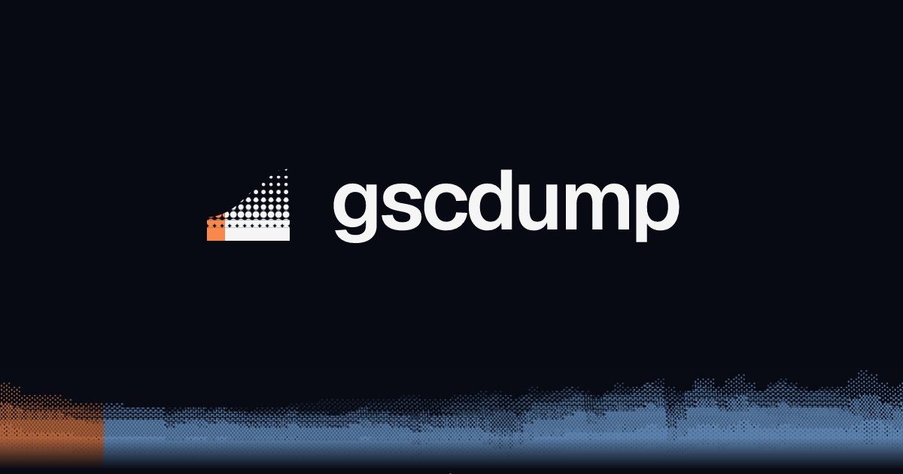

<p align="center">
  <a href="https://gscdump.com"></a>
</p>

[](https://npmjs.com/package/gscdump)
[](https://npm.chart.dev/gscdump)
[](https://github.com/harlan-zw/gscdump/blob/main/LICENSE)

> Google Search Console data and SEO analysis for TypeScript, the CLI, and AI assistants.

Tell your agent:

> Set up gscdump using this skill: https://gscdump.com/SKILL.md

If you cloned this repository, use [`packages/cli/skills/gscdump/SKILL.md`](./packages/cli/skills/gscdump/SKILL.md) instead.

<p align="center">
<table>
<tbody>
<td align="center">
<sub>Made possible by my <a href="https://github.com/sponsors/harlan-zw">Sponsor Program 💖</a><br> Follow me <a href="https://twitter.com/harlan_zw">@harlan_zw</a> 🐦 • Join <a href="https://discord.gg/275MBUBvgP">Discord</a> for help</sub><br>
</td>
</tbody>
</table>
</p>

## Features

- 🤖 **AI assistants:** run Reports through the CLI or MCP and read the results as JSON.
- 🔍 **29 SEO Analyzers:** find content decay, competing pages, traffic changes, and queries worth targeting.
- 📋 **Reports:** eight Reports combine Analyzers to answer questions about your search traffic.
- 💾 **Own your data:** sync Search Console rows to a local Parquet Store and query them with DuckDB.
- ⚡ **Indexing and sitemaps:** inspect URLs, send eligible indexing notifications, and manage sitemap submissions.
- 🎯 **Typed query builder:** select dimensions, filter rows, and stream paginated results from Google.
- 🌐 **Edge support:** use the core library in Cloudflare Workers, Deno, Bun, or Node.js.

## What is gscdump?

gscdump gives you Google Search Console data without building your own API integration.
Query Google directly, keep a local history, or run SEO analysis from the CLI and your AI assistant.
The CLI and TypeScript library also read Bing Webmaster data and Indexing Evidence.
The CLI supports shared hosted authentication and local Google or Bing credentials.
See [Bing commands and authentication](./packages/cli/README.md#hosted-and-local-authentication).

The core library uses `fetch` and supports edge runtimes.
For the CLI, use Node.js 22.13 or later in the 22 release line, or Node.js 24 or later.
You control how long you keep synced data.
Google still limits which rows its API returns; pagination cannot recover omitted data.
See [Google's data limits](https://developers.google.com/webmaster-tools/v1/how-tos/all-your-data#data-limits).

## Get Started

```bash
npm install -g @gscdump/cli

# Set up local Google OAuth credentials and a Store directory
gscdump init --mode local
gscdump auth login --mode local
gscdump sites

# Sync before querying or exporting stored data
gscdump sync --site sc-domain:example.com --days 90
gscdump query --site sc-domain:example.com --dimensions page,query
gscdump dump --site sc-domain:example.com --out ./export

# Query Google directly
gscdump query --live --mode local --site sc-domain:example.com --dimensions page,query

# Start the MCP server
gscdump mcp
```

For one-off commands, use `npx -y @gscdump/cli` in place of `gscdump`.
The `gscdump` npm package contains the library; `@gscdump/cli` provides the command.

To use connections saved on gscdump.com:

```bash
export GSCDUMP_API_KEY=gsd_user_...
gscdump auth login --mode cloud
gscdump sites --json
gscdump bing sites --json
gscdump bing login --site s_SITE_ID
gscdump bing dump --site s_SITE_ID --format csv --out ./bing-export
```

Complete the Bing browser connection before exporting.
For local Bing credentials and available operations, see [CLI authentication](./packages/cli/README.md#hosted-and-local-authentication).

Guides:

- [Getting started](./docs/guides/getting-started.md)
- [Keep historical data](./docs/guides/historical-database.md)
- [SEO analysis](./docs/guides/seo-analysis.md)
- [AI integration](./docs/guides/ai-integration.md)
- [URL inspection and indexing](./docs/guides/url-indexing.md)

### Commands

| Command | Description |
| --- | --- |
| `init` | Set up OAuth credentials and the Store directory |
| `auth` | Manage authentication with `status`, `login`, and `logout` |
| `bing` | Connect Bing, export datasets, inspect URLs, and check cloud connection verification |
| `profile` | Manage separate credential profiles |
| `dump` | Export stored files to a directory |
| `query` | Query stored rows, or Google with `--live` |
| `sync` | Fetch Google data into the Store |
| `sites [--with-sitemaps]` | List Sites and manage Site verification |
| `sitemaps` | List, submit, delete, and discover sitemaps |
| `inspect <url>` / `inspect batch` | Inspect one URL or a batch of URLs |
| `indexing` | Send eligible notifications with `submit`, `remove`, and `batch`; read metadata with `status`; list hosted URL Inspection results with `urls` |
| `analyze <tool>` | Run one Analyzer |
| `report <id>` | Run a Report |
| `entities` | Save URL inspections and indexing notification metadata locally |
| `store stats` | Show row counts, file sizes, and sync progress |
| `store compact` | Combine older daily partitions into monthly files |
| `store gc` | Delete orphaned Store files |
| `store export` | Export a DuckDB file |
| `store rollups` | Rebuild Rollups |
| `config` | Manage CLI configuration |
| `doctor` | Diagnose setup problems |
| `mcp` | Start the MCP server |
| `skill install` | Copy the agent skill (SKILL.md) into `~/.claude/skills` or `~/.codex/skills` |
| `papercut` | Report a CLI problem to gscdump.com (anonymous) |

See the [CLI reference](./packages/cli/README.md) for flags and authentication options.

### Analyzers

Run `gscdump analyze <tool> --help` for each Analyzer's options.
Twelve Analyzers support live rows; all 29 support SQL over stored data.
See [Source support](./packages/analysis/README.md#sources) before choosing `--live`.

| Analyzer | What it finds |
|------|------------------|
| `striking-distance` | Queries in positions 4 to 20 with low CTR |
| `opportunity` | High-impression, low-CTR pages worth optimizing |
| `movers` | Largest changes in clicks and impressions since the comparison period |
| `decay` | Pages losing traffic over time |
| `survival` | How long pages keep receiving traffic |
| `change-point` | Statistical breakpoints in traffic |
| `brand` | Share of clicks from brand and non-brand queries |
| `cannibalization` | Multiple pages competing for the same query |
| `clustering` | Groups of related queries by prefix or intent |
| `concentration` | How traffic concentrates across pages/queries |
| `seasonality` | Weekly and monthly traffic patterns |
| `stl-decompose` | Traffic split into trend, seasonal changes, and remaining variation |
| `zero-click` | High-impression queries with no clicks |
| `trends` | Clicks and impressions across rolling date windows |
| `ctr-curve` | Observed CTR at each position for the Site |
| `ctr-anomaly` | Pages with CTR above or below the expected rate |
| `bayesian-ctr` | Shrinkage-adjusted CTR estimates |
| `position-distribution` | Ranking positions for each page or query |
| `position-volatility` | How much rankings change over time |
| `intent-atlas` | Search Intent across the Site's queries |
| `query-migration` | Queries shifting between pages over time |
| `keyword-breadth` | How many queries each page ranks for |
| `long-tail` | Traffic split between common and less frequent queries |
| `dark-traffic` | Estimated share of impressions from anonymized queries |
| `device-gap` | Desktop vs. mobile performance gaps |
| `bipartite-pagerank` | Pages and queries with the most influence in their shared graph |
| `content-velocity` | How new pages contribute to traffic over time |
| `data-detail` / `data-query` | Rows for closer inspection |

## Reports

`gscdump report <id>` combines Analyzers into a `ReportResult` with bounded Sections of findings.

| Report | Analyzers | Default window | Comparison |
|--------|------------|----------------|------------|
| `health` | ctr-anomaly, change-point, position-volatility | 28d | none |
| `movers` | movers, decay, striking-distance | 7d | prev-period |
| `opportunities` | striking-distance, opportunity, zero-click, query-migration | 28d | none |
| `risks` | decay, cannibalization, dark-traffic, device-gap | 28d | prev-period |
| `growth` | content-velocity, keyword-breadth, intent-atlas, long-tail | 90d | yoy |
| `brand` | brand (`--brand-terms`), concentration | 28d | none |
| `triage` | change-point + query-migration + position-volatility scoped to `--target` | 90d | none |
| `pre-publish` | cannibalization + striking-distance scoped to `--topic` | 90d | none |

```bash
# List Reports
gscdump report list

# Preview a Report without credentials or API calls
gscdump report movers --explain

# Return a Report as JSON
gscdump report opportunities --site sc-domain:example.com --json

# Run Reports with extra inputs
gscdump report triage --site sc-domain:example.com --target /blog/foo --target-kind page --json
gscdump report pre-publish --site sc-domain:example.com --topic widgets --json
gscdump report brand --site sc-domain:example.com --brand-terms 'acme,acme corp' --json
```

Use `--period` for `7d`, `28d`, `30d`, `90d`, `180d`, `365d`, `mtd`, `ytd`, or `custom`.
Use `--vs` for `none`, `prev-period`, or `yoy`.
Custom windows need `--start` and `--end`; comparison overrides use `--prev-start` and `--prev-end`.

Analyzer, Report, and Section IDs are separate namespaces.
For example, `brand` names both an Analyzer and a Report.

### Programmatic use

Install the Report runtime and live Google API Source:

```bash
npm install gscdump @gscdump/analysis @gscdump/engine @gscdump/engine-gsc-api
```

```ts
import { defaultAnalyzerRegistry } from '@gscdump/analysis/registry'
import { defaultReportRegistry, runReport } from '@gscdump/analysis/report'
import { createGscApiQuerySource } from '@gscdump/engine-gsc-api'
import { resolveWindow } from '@gscdump/engine/period'
import { googleSearchConsole } from 'gscdump'

const client = googleSearchConsole({ accessToken: process.env.GSC_ACCESS_TOKEN! })
const siteUrl = 'sc-domain:example.com'
const report = defaultReportRegistry.getReport('movers')!
const window = resolveWindow({ preset: 'last-7d', comparison: 'prev-period' })
const source = createGscApiQuerySource({ client, siteUrl })

const result = await runReport(report, {
  source,
  analyzers: defaultAnalyzerRegistry,
  ctx: { site: siteUrl, window, params: {}, registryVersion: defaultReportRegistry.version },
})

console.log(result.sections)
console.log(result.meta.degraded) // True if an optional step failed
```

Use `defineReport()` from `@gscdump/engine/report` to create a Report or adapt an existing one:

```ts
import { defaultReportRegistry } from '@gscdump/analysis/report'
import { defineReport } from '@gscdump/engine/report'

export const monthlyMovers = defineReport({
  ...defaultReportRegistry.getReport('movers')!,
  id: 'monthly-movers',
  description: 'Traffic changes over the last 30 days.',
  defaultPeriod: 'last-30d',
})
```

**Known v1 limitations:**

- Reports with required SQL-only Analyzers, such as `health`, need a stored Source.
- Some `growth` Sections return aggregate summaries instead of per-row findings. Use `artifact.analyzer` to inspect their data.
- The `brand` Report's concentration step covers the whole Site.

## MCP Server

Add this entry to your MCP client's server configuration:

```json
{
  "mcpServers": {
    "gscdump": {
      "command": "npx",
      "args": ["-y", "@gscdump/cli", "mcp"]
    }
  }
}
```

Authenticate first with cloud mode or local Google credentials. MCP uses the selected mode for Google tools.
Google Indexing API and Site Verification tools require local mode. Run Bing commands through the CLI and agent skill.
Then ask your assistant:

- "List my Search Console Sites."
- "Run the movers Report for `sc-domain:example.com` over the last 28 days."
- "Query clicks and impressions by page for this month."
- "Inspect these URLs and summarize the Indexing Evidence."

### MCP Tools

**Reports:** `list-reports`, `run-report`.
`list-reports` returns Report descriptions, date defaults, and argument definitions.
`run-report` accepts the Site, Report ID, date windows, comparison, and maximum findings.

MCP Reports read live Google data through the selected authentication mode.
Discovery lists `brand`, `movers`, `opportunities`, `pre-publish`, and `risks`.
Supply `brandTerms` for `brand` and `topic` for `pre-publish`.
Some optional SQL Sections return an unknown result with an explanation.
Use the CLI with a Store for `health`, `growth`, and `triage`.

**Sites:** `list-sites`, `list-sites-with-sitemaps`, `add-site`, `delete-site`.

**Verification:** `get-verification-token`, `verify-site`, `list-verified-sites`, `get-verified-site`, `unverify-site`.

**Sitemaps:** `list-sitemaps`, `get-sitemap`, `submit-sitemap`, `delete-sitemap`, `discover-sitemap`.

**Custom queries:** `query` returns rows with dimension filters and date ranges.

**Indexing:** `inspect-url`, `batch-inspect-urls`, `request-indexing`, `batch-request-indexing`, `get-indexing-status`, `batch-get-indexing-status`.
Indexing notifications apply only to [eligible job and livestream pages](https://developers.google.com/search/apis/indexing-api/v3/using-api).

**Diagnostics:** `diagnostics` checks credentials and API scopes.

See [AI integration](./docs/guides/ai-integration.md) for configuration and Report limits.

## API Usage

```bash
npm install gscdump
```

```ts
import { googleSearchConsole } from 'gscdump'
import { between, date, daysAgo, gsc, page, query } from 'gscdump/query'

const client = googleSearchConsole({ accessToken: process.env.GSC_ACCESS_TOKEN! })
const request = gsc
  .select(page, query)
  .where(between(date, daysAgo(30), daysAgo(3)))
  .limit(10000)

for await (const rows of client.query('sc-domain:example.com', request)) {
  console.log(rows)
}
```

See the [core library](./packages/gscdump/README.md) for authentication, query methods, and Bing Indexing Evidence.

### Query Builder

```ts
import { and, between, contains, country, date, daysAgo, device, eq, gsc, page, query } from 'gscdump/query'

const builder = gsc
  .select(page, query, device, country)
  .where(and(
    eq(device, 'MOBILE'),
    contains(page, '/blog/'),
    between(date, daysAgo(30), daysAgo(3)),
  ))
  .limit(25000)

const body = builder.toBody()
```

**Dimensions:** `page`, `query`, `date`, `country`, `device`, `searchAppearance`.

**Operators:** `eq`, `ne`, `contains`, `like`, `regex`, `notRegex`, `inArray`, `between`, `and`, `or`, `not`.

### Other Client Methods

Using the `client` from [API Usage](#api-usage):

```ts
const siteUrl = 'sc-domain:example.com'
const url = 'https://example.com/jobs/frontend-engineer'

const sites = await client.sites()
const inspection = await client.inspect(siteUrl, url)

const sitemaps = await client.sitemaps.list(siteUrl)
await client.sitemaps.submit(siteUrl, 'https://example.com/sitemap.xml')

// For eligible job or livestream pages
await client.indexing.publish(url, 'URL_UPDATED')
const metadata = await client.indexing.getMetadata(url)
```

## Auth Setup

Choose [cloud or local authentication](./packages/cli/README.md#hosted-and-local-authentication) for Google and Bing.
Cloud mode uses a gscdump user API key and saved Search Engine connections.
For local Google OAuth:

1. Create a Google Cloud project and enable the Search Console API.
2. Configure the OAuth consent screen and create OAuth credentials for a Desktop app.
3. Run `gscdump init --mode local` to save your credentials and Store settings.
4. Run `gscdump auth login --mode local` to save local mode.

Enable the Web Search Indexing API if you need eligible indexing notifications.
Use `gscdump auth login --mode local` to authenticate without running the full setup.
See [Getting started](./docs/guides/getting-started.md) for service accounts and other authentication options.

### BYOK environment variables

Local Google authentication accepts environment credentials, so you can skip `init`.
Use one of these options:

```bash
# Access token
export GSC_ACCESS_TOKEN=ya29...

# Or OAuth refresh-token credentials
export GSC_CLIENT_ID=...
export GSC_CLIENT_SECRET=...
export GSC_REFRESH_TOKEN=...
```

The CLI prefers `GSC_*` names and also accepts their `GOOGLE_*` equivalents.
Run `gscdump auth login --mode local` to save local mode after setting environment credentials.
In local mode, `gscdump auth status` reports `byok` for Google environment credentials.

## Hosted API v1

Use `@gscdump/sdk/v1` for the hosted gscdump.com API.
The current contracts describe 58 HTTP operations: 53 partner, three analytics, and two realtime operations.
The API wire version is `1.0`, separate from npm package versions.

Start with the [hosted integration guide](./docs/guides/hosted-v1.md).
The [generated contracts](./packages/contracts/generated) define operation inputs and responses.
Existing integrations can use the [migration guide](./docs/v1-migration.md).

## Packages

| Package | Description |
| --- | --- |
| [`gscdump`](./packages/gscdump) | Google and Bing clients, typed query builder |
| [`@gscdump/analysis`](./packages/analysis) | Analyzers and Reports |
| [`@gscdump/engine`](./packages/engine) | Parquet storage, DuckDB execution, and Source contracts |
| [`@gscdump/engine-duckdb-wasm`](./packages/engine-duckdb-wasm) | Browser DuckDB runtime |
| [`@gscdump/engine-sqlite`](./packages/engine-sqlite) | SQLite and D1 adapter |
| [`@gscdump/engine-gsc-api`](./packages/engine-gsc-api) | Live Google API Source |
| [`@gscdump/lakehouse`](./packages/lakehouse) | Iceberg catalog and dataset registry |
| [`@gscdump/contracts`](./packages/contracts) | Hosted API schemas and operation metadata |
| [`@gscdump/sdk`](./packages/sdk) | Hosted HTTP, realtime, and webhook clients |
| [`@gscdump/cloudflare`](./packages/cloudflare) | Cloudflare server-tail and request deduplication helpers |
| [`@gscdump/cli`](./packages/cli) | CLI and MCP server (`gscdump mcp`) |

## Support and contributions

| Entry point | Scope | First result |
| --- | --- | --- |
| CLI | Cloud/local Google and Bing authentication, local Store, exports | [Getting started](./docs/guides/getting-started.md) |
| Core library | Google and Bing clients, typed queries, fetch runtimes | [Library examples](./packages/gscdump/README.md) |
| MCP | Live Google queries and supported Reports | [AI integration](./docs/guides/ai-integration.md) |
| Hosted SDK | gscdump.com API credentials and published v1 operations | [Hosted integration](./docs/guides/hosted-v1.md) |
| Runtime adapters | Browser DuckDB, SQLite, and Cloudflare integrations | Package READMEs above |

Use the latest published version when reporting a bug.
See [Contributing](./CONTRIBUTING.md) for setup and checks.
Report vulnerabilities through [Security](./SECURITY.md).

## License

[MIT](./LICENSE)
