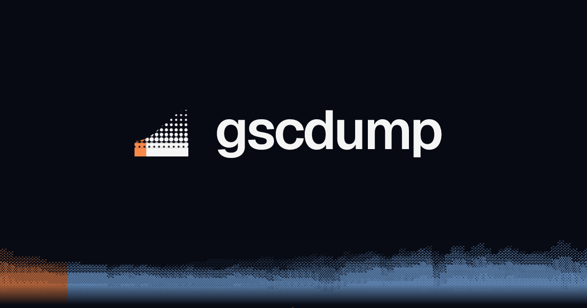

<p align="center">
  <a href="https://gscdump.com"></a>
</p>

[](https://npmjs.com/package/gscdump)
[](https://npm.chart.dev/gscdump)
[](https://github.com/harlan-zw/gscdump/blob/main/LICENSE)
[](https://skilld.dev/gh/harlan-zw/gscdump)

> Dump your entire Google Search Console dataset and put your agents to work finding insights and improving your SEO.

<p align="center">
<table>
<tbody>
<td align="center">
<sub>Made possible by my <a href="https://github.com/sponsors/harlan-zw">Sponsor Program 💖</a><br> Follow me <a href="https://twitter.com/harlan_zw">@harlan_zw</a> 🐦 • Join <a href="https://discord.gg/275MBUBvgP">Discord</a> for help</sub><br>
</td>
</tbody>
</table>
</p>

## Features

- 🤖 **AI assistants:** run Reports through the CLI or MCP and read the results as JSON.
- 🔍 **29 SEO Analyzers:** find content decay, competing pages, traffic changes, and queries worth targeting.
- 📋 **Reports:** eight Reports combine Analyzers to answer questions about your search traffic.
- 💾 **Own your data:** sync Search Console rows to a local Parquet Store and query them with DuckDB.
- ⚡ **Indexing and sitemaps:** inspect URLs, send eligible indexing notifications, and manage sitemap submissions.
- 🎯 **Typed query builder:** select dimensions, filter rows, and stream paginated results from Google.
- 🌐 **Edge support:** use the core library in Cloudflare Workers, Deno, Bun, or Node.js.

## What is gscdump?

Google Search Console's API answers narrow questions and [limits how much you can ask](https://gscdump.com/learn-google-search-console/api/rate-limits).
Its [16-month history window](https://gscdump.com/learn-google-search-console/limits/16-month-data-retention) keeps moving.
Comparing pages and queries over time takes extra work, especially when you want a chart.

With gscdump, you can keep the data you collect and compare old periods with new ones.
See the changes in charts, then ask your agents about the same record.
Keep your own copy for deeper analysis.
Google's [row limits](https://gscdump.com/learn-google-search-console/limits/export-row-limits) still decide what data is available.

## Get Started

Tell your agent:

> Use this Skill: https://skilld.dev/gh/harlan-zw/gscdump

Install the CLI with Node.js 22.13 or later in the 22 release line, or Node.js 24 or later:

```bash
npm install -g @gscdump/cli
```

Choose where the CLI gets Google access:

| Path | Login | Google data requests |
| --- | --- | --- |
| Cloud | gscdump.com browser sign-in | gscdump.com calls Google |
| Local, gscdump.com OAuth | Google sign-in through gscdump.com | The CLI calls Google directly |
| Local, your Google credentials | Your OAuth client or service account | The CLI calls Google directly |

### Cloud access

Cloud login opens gscdump.com in your browser. Sign in, authorize the CLI, then [connect a Site](https://gscdump.com/app/sites/add). The CLI saves its own session. You do not need to copy an API key.

```bash
gscdump auth login --mode cloud
gscdump sites
gscdump query --live --site example.com --dimensions date --limit 7
```

See [the cloud first-result guide](./docs/gscdump-cli/guides/1.start/1.first-result.md) for the full path.

### Local access

For local access without a Google Cloud project, run `gscdump auth login --mode local`. The browser opens gscdump.com for OAuth. The CLI then calls Google directly.

For a fully local connection, create a Desktop OAuth client in Google Cloud and set `GSC_CLIENT_ID` and `GSC_CLIENT_SECRET` before login. This path opens Google directly. The [access guide](./docs/gscdump-cli/guides/1.start/2.choose-access.md#local-access) also covers service accounts and existing Google tokens.

```bash
export GSC_CLIENT_ID=your-client-id
export GSC_CLIENT_SECRET=your-client-secret

gscdump init --mode local
gscdump sites

# Read a quick result from Google
gscdump query --live --mode local --site example.com --dimensions date --limit 7

# Sync before querying or exporting stored data; start with one day
gscdump sync --site example.com --days 1
gscdump query --site example.com --dimensions page,query
gscdump dump --site example.com --out ./export

# Build more history when ready
gscdump sync --site example.com --days 90

# Start the MCP server
gscdump mcp
```

For one-off commands, use `npx -y @gscdump/cli` in place of `gscdump`.
The `gscdump` npm package contains the library; `@gscdump/cli` provides the command.

## Documentation

- [SDK documentation](./docs/gscdump-sdk/guides/1.start/index.md)
- [Getting started](./docs/gscdump-cli/guides/1.start/1.first-result.md)
- [Authentication](./docs/gscdump-cli/guides/1.start/2.choose-access.md)
- [Command reference](./docs/gscdump-cli/api/1.commands.md)
- [Keep historical data](./docs/gscdump-cli/guides/2.use-data/1.build-history.md)
- [Analyzers](./docs/gscdump-cli/api/6.analyzers.md) and [Reports](./docs/gscdump-cli/api/7.reports.md)
- [SEO analysis](./docs/gscdump-cli/guides/3.investigate-traffic/index.md)
- [AI integration and MCP](./docs/gscdump-cli/guides/1.start/3.connect-an-agent.md)
- [URL inspection and indexing](./docs/gscdump-cli/guides/4.check-visibility/2.indexing-evidence.md)
- [CLI charts](./docs/gscdump-cli/guides/2.use-data/2.query-and-export.md)

## API Usage

```bash
npm install gscdump
```

```ts
import { googleSearchConsole } from 'gscdump'
import { between, date, daysAgo, gsc, page, query } from 'gscdump/query'

const client = googleSearchConsole({ accessToken: process.env.GSC_ACCESS_TOKEN! })
const request = gsc
  .select(page, query)
  .where(between(date, daysAgo(30), daysAgo(3)))
  .limit(10000)

for await (const rows of client.query('sc-domain:example.com', request)) {
  console.log(rows)
}
```

See the [core library](./packages/gscdump/README.md) for authentication, query methods, and Bing Indexing Evidence.

### Query Builder

```ts
import { and, between, contains, country, date, daysAgo, device, eq, gsc, page, query } from 'gscdump/query'

const builder = gsc
  .select(page, query, device, country)
  .where(and(
    eq(device, 'MOBILE'),
    contains(page, '/blog/'),
    between(date, daysAgo(30), daysAgo(3)),
  ))
  .limit(25000)

const body = builder.toBody()
```

**Dimensions:** `page`, `query`, `date`, `country`, `device`, `searchAppearance`.

**Operators:** `eq`, `ne`, `contains`, `like`, `regex`, `notRegex`, `inArray`, `between`, `and`, `or`, `not`.

### Other Client Methods

Using the `client` from [API Usage](#api-usage):

```ts
const siteUrl = 'sc-domain:example.com'
const url = 'https://example.com/jobs/frontend-engineer'

const sites = await client.sites()
const inspection = await client.inspect(siteUrl, url)

const sitemaps = await client.sitemaps.list(siteUrl)
await client.sitemaps.submit(siteUrl, 'https://example.com/sitemap.xml')

// For eligible job or livestream pages
await client.indexing.publish(url, 'URL_UPDATED')
const metadata = await client.indexing.getMetadata(url)
```

## Hosted API v1

Use `@gscdump/sdk/v1` for the hosted gscdump.com API.
The current contracts describe 58 HTTP operations: 53 partner, three analytics, and two realtime operations.
The API wire version is `1.0`, separate from npm package versions.

Start with the [hosted integration guide](./docs/guides/hosted-v1.md).
The [generated contracts](./packages/contracts/generated) define operation inputs and responses.

## Packages

| Package | Description |
| --- | --- |
| [`gscdump`](./packages/gscdump) | Google and Bing clients, typed query builder |
| [`@gscdump/analysis`](./packages/analysis) | Analyzers and Reports |
| [`@gscdump/engine`](./packages/engine) | Parquet storage, DuckDB execution, and Source contracts |
| [`@gscdump/engine-duckdb-wasm`](./packages/engine-duckdb-wasm) | Browser DuckDB runtime |
| [`@gscdump/engine-sqlite`](./packages/engine-sqlite) | SQLite and D1 adapter |
| [`@gscdump/engine-gsc-api`](./packages/engine-gsc-api) | Live Google API Source |
| [`@gscdump/lakehouse`](./packages/lakehouse) | Iceberg catalog and dataset registry |
| [`@gscdump/contracts`](./packages/contracts) | Hosted API schemas and operation metadata |
| [`@gscdump/sdk`](./packages/sdk) | Hosted HTTP, realtime, and webhook clients |
| [`@gscdump/cloudflare`](./packages/cloudflare) | Cloudflare server-tail and request deduplication helpers |
| [`@gscdump/cli`](./packages/cli) | CLI and MCP server (`gscdump mcp`) |

## Support and contributions

| Entry point | Scope | First result |
| --- | --- | --- |
| CLI | Cloud/local Google and Bing authentication, local Store, exports | [Getting started](./docs/gscdump-cli/guides/1.start/1.first-result.md) |
| Core library | Google and Bing clients, typed queries, fetch runtimes | [Library examples](./packages/gscdump/README.md) |
| MCP | Live Google queries and supported Reports | [AI integration](./docs/gscdump-cli/guides/1.start/3.connect-an-agent.md) |
| Hosted SDK | gscdump.com API credentials and published v1 operations | [Hosted integration](./docs/gscdump-sdk/guides/1.start/2.hosted-first-result.md) |
| Runtime adapters | Browser DuckDB, SQLite, and Cloudflare integrations | Package READMEs above |

Use the latest published version when reporting a bug.
See [Contributing](./CONTRIBUTING.md) for setup and checks.
Report vulnerabilities through [Security](./SECURITY.md).

## License

[MIT](./LICENSE)
