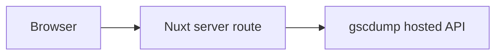

# Read hosted analytics in Nuxt

An authenticated browser calls your Nuxt route. Only the server route reads the API key.



## Before you start

Complete [Hosted first result](/gscdump-sdk/guides/start/hosted-first-result). Configure [Nuxt Auth Utils](https://nuxt.com/docs/4.x/guide/recipes/sessions-and-authentication) with a verified user email. Install `@gscdump/sdk`. Set `NUXT_GSCDUMP_API_KEY`, `NUXT_GSCDUMP_SITE_ID`, and `NUXT_GSCDUMP_ALLOWED_EMAIL` in the server environment. This example grants that user access to one configured Site.

## Create a Nuxt server route

Add private runtime config in `nuxt.config.ts`:

```ts
export default defineNuxtConfig({
  runtimeConfig: {
    gscdumpApiKey: '',
    gscdumpSiteId: '',
    gscdumpAllowedEmail: '',
  },
})
```

Add `server/api/search.get.ts`. The keys stay outside `runtimeConfig.public`:

```ts
import { createGscdumpV1Client, isGscdumpV1Error } from '@gscdump/sdk/v1'

export default defineEventHandler(async (event) => {
  const { user } = await requireUserSession(event)
  const config = useRuntimeConfig(event)
  if (!config.gscdumpAllowedEmail || user.email !== config.gscdumpAllowedEmail)
    throw createError({ statusCode: 403, statusMessage: 'Site access denied' })
  if (!config.gscdumpApiKey || !config.gscdumpSiteId)
    throw createError({ statusCode: 503, statusMessage: 'Search data is unavailable' })

  const client = createGscdumpV1Client({
    credential: () => config.gscdumpApiKey,
  })
  try {
    const response = await client.queryAnalyticsRows({
      params: { siteId: config.gscdumpSiteId },
      body: { dimensions: ['query'], metrics: ['clicks'], rowLimit: 10 },
    })
    return { rows: response.data.rows }
  }
  catch (error) {
    if (isGscdumpV1Error(error))
      console.error('gscdump request', error.code, error.requestId)
    else
      throw error
    throw createError({ statusCode: 502, statusMessage: 'Search data is unavailable' })
  }
})
```

## Fetch the route in a page

```vue
<script setup lang="ts">
const { data, error, status } = await useFetch('/api/search')
</script>

<template>
  <p v-if="status === 'pending'">Loading search data…</p>
  <p v-else-if="error">Search data is unavailable.</p>
  <p v-else-if="!data?.rows.length">No matching rows.</p>
  <pre v-else>{{ data.rows }}</pre>
</template>
```

## Handle failure

The route checks the signed-in user and Site allowlist before the SDK call. It logs [typed API errors](/gscdump-sdk/guides/operate/errors-and-retry) on the server and returns a safe browser message.

## Check the result

Open `/api/search` as the allowed user and as a different user. The second request must return `403`. Confirm the browser response includes rows or a safe empty state. Search built assets for your API key. Continue with [Hosted analytics](/gscdump-sdk/guides/read-data/hosted-analytics) when you need Report totals.
