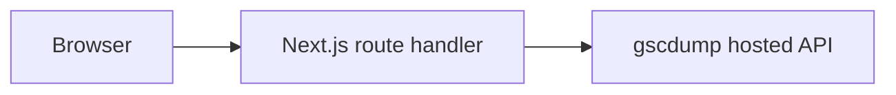

# Read hosted analytics in Next.js

Keep the user API key in the server environment. Check the caller before a route or page reads Site data.



## Before you start

Complete [Hosted first result](/gscdump-sdk/guides/start/hosted-first-result). Configure [Auth.js](https://authjs.dev/getting-started/installation) so `auth()` returns a verified user email. Install `@gscdump/sdk`. Set `GSCDUMP_API_KEY`, `GSCDUMP_SITE_ID`, and `GSCDUMP_ALLOWED_EMAIL` on the server. This example grants that user access to one configured Site.

## Create a route handler

Add `app/api/search/route.ts`:

```ts
import { createGscdumpV1Client, isGscdumpV1Error } from '@gscdump/sdk/v1'
import { auth } from '@/auth'

export const dynamic = 'force-dynamic'

export async function GET() {
  const session = await auth()
  if (!session?.user?.email) {
    return Response.json({ error: 'Sign in required' }, { status: 401 })
  }
  if (!process.env.GSCDUMP_ALLOWED_EMAIL
    || session.user.email !== process.env.GSCDUMP_ALLOWED_EMAIL) {
    return Response.json({ error: 'Site access denied' }, { status: 403 })
  }

  const apiKey = process.env.GSCDUMP_API_KEY
  const siteId = process.env.GSCDUMP_SITE_ID
  if (!apiKey || !siteId)
    return Response.json({ error: 'Search data is unavailable' }, { status: 503 })

  const client = createGscdumpV1Client({ credential: () => apiKey })
  try {
    const result = await client.queryAnalyticsRows({
      params: { siteId },
      body: { dimensions: ['query'], metrics: ['clicks'], rowLimit: 10 },
    })
    return Response.json({ rows: result.data.rows }, {
      headers: { 'Cache-Control': 'private, no-store' },
    })
  }
  catch (error) {
    if (isGscdumpV1Error(error))
      console.error('gscdump request', error.code, error.requestId)
    else
      throw error
    return Response.json({ error: 'Search data is unavailable' }, { status: 502 })
  }
}
```

## Render rows in a server component

A server page can call the same SDK function directly. If you use the route above, fetch it from a client component instead. The route is useful when other same-origin clients need the data.

```tsx
import { createGscdumpV1Client, isGscdumpV1Error } from '@gscdump/sdk/v1'
import { auth } from '@/auth'

export default async function SearchPage() {
  const session = await auth()
  if (!session?.user?.email) {
    return <p>Sign in required.</p>
  }
  if (!process.env.GSCDUMP_ALLOWED_EMAIL
    || session.user.email !== process.env.GSCDUMP_ALLOWED_EMAIL) {
    return <p>Site access denied.</p>
  }

  const apiKey = process.env.GSCDUMP_API_KEY
  const siteId = process.env.GSCDUMP_SITE_ID
  if (!apiKey || !siteId)
    return <p>Search data is unavailable.</p>

  const client = createGscdumpV1Client({ credential: () => apiKey })
  try {
    const result = await client.queryAnalyticsRows({
      params: { siteId },
      body: { dimensions: ['query'], metrics: ['clicks'], rowLimit: 10 },
    })
    return result.data.rows.length
      ? <pre>{JSON.stringify(result.data.rows, null, 2)}</pre>
      : <p>No matching rows.</p>
  }
  catch (error) {
    if (isGscdumpV1Error(error))
      console.error('gscdump request', error.code, error.requestId)
    else
      throw error
    return <p>Search data is unavailable.</p>
  }
}
```

## Handle failure

Both examples check the session and Site allowlist before calling the SDK. They log [typed error](/gscdump-sdk/guides/operate/errors-and-retry) IDs on the server and return safe states. Decide caching deliberately because Site access and recent data can change.

## Check the result

Open `/api/search` and the page as the allowed user and a different user. The route must return `403` for the second user. Confirm the API key is absent from responses and browser bundles. Use [Hosted analytics](/gscdump-sdk/guides/read-data/hosted-analytics) for Report totals and sync metadata.
