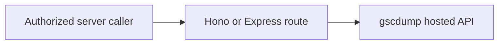

# Serve hosted analytics with Hono or Express

Both handlers use the same request function. A separate caller key protects this server-to-server endpoint.



## Before you start

Complete [Hosted first result](/gscdump-sdk/guides/start/hosted-first-result). These Hono and Express examples target Node.js. Cloudflare Workers need environment bindings instead of `process.env` and a different Node server entrypoint. Set `GSCDUMP_API_KEY`, `GSCDUMP_SITE_ID`, and a separate `APP_CALLER_KEY` in the server environment. Give the caller key only to servers authorized for this one configured Site. Do not call this endpoint from browser code.

## Call the SDK once

Put the shared request in `search.ts`:

```ts
import { createGscdumpV1Client } from '@gscdump/sdk/v1'

export async function readSearchRows() {
  const apiKey = process.env.GSCDUMP_API_KEY
  const siteId = process.env.GSCDUMP_SITE_ID
  if (!apiKey || !siteId)
    throw new Error('Search data is not configured')

  const client = createGscdumpV1Client({ credential: () => apiKey })
  const result = await client.queryAnalyticsRows({
    params: { siteId },
    body: { dimensions: ['query'], metrics: ['clicks'], rowLimit: 10 },
  })
  return result.data.rows
}
```

## Add a Hono handler

Hono's [Bearer Auth middleware](https://hono.dev/docs/middleware/builtin/bearer-auth) rejects missing or wrong caller keys.

```ts
import { isGscdumpV1Error } from '@gscdump/sdk/v1'
import { Hono } from 'hono'
import { bearerAuth } from 'hono/bearer-auth'
import { readSearchRows } from './search'

const callerKey = process.env.APP_CALLER_KEY
if (!callerKey)
  throw new Error('Set APP_CALLER_KEY')

const app = new Hono()
app.use('/api/search/*', bearerAuth({ token: callerKey }))
app.get('/api/search/:siteId', async (c) => {
  if (c.req.param('siteId') !== process.env.GSCDUMP_SITE_ID)
    return c.json({ error: 'Site access denied' }, 403)
  try {
    const rows = await readSearchRows()
    return c.json({ rows })
  }
  catch (error) {
    if (!isGscdumpV1Error(error))
      throw error
    console.error('gscdump request', error.code, error.requestId)
    return c.json({ error: 'Search data is unavailable' }, 502)
  }
})
export default app
```

## Add an Express handler

```ts
import { Buffer } from 'node:buffer'
import { timingSafeEqual } from 'node:crypto'
import { isGscdumpV1Error } from '@gscdump/sdk/v1'
import express from 'express'
import { readSearchRows } from './search'

const callerKey = process.env.APP_CALLER_KEY
if (!callerKey)
  throw new Error('Set APP_CALLER_KEY')

const app = express()
app.use('/api/search/:siteId', (request, response, next) => {
  const received = Buffer.from(request.header('authorization') ?? '')
  const expected = Buffer.from(`Bearer ${callerKey}`)
  if (received.length !== expected.length || !timingSafeEqual(received, expected))
    return response.status(401).json({ error: 'Unauthorized' })
  next()
})
app.get('/api/search/:siteId', async (request, response, next) => {
  if (request.params.siteId !== process.env.GSCDUMP_SITE_ID)
    return response.status(403).json({ error: 'Site access denied' })
  try {
    const rows = await readSearchRows()
    response.json({ rows })
  }
  catch (error) {
    if (!isGscdumpV1Error(error))
      return next(error)
    console.error('gscdump request', error.code, error.requestId)
    response.status(502).json({ error: 'Search data is unavailable' })
  }
})
export default app
```

## Handle and check errors

The caller key authorizes one pinned Site. The handlers log a [typed error request ID](/gscdump-sdk/guides/operate/errors-and-retry) and return a safe message. Add an Express error handler for unexpected errors. Check `/api/search/<siteId>` with a valid caller key, a wrong key, and no key. Wrong and missing keys must return `401`. A different Site ID must return `403`. Both checks happen before an SDK request. Neither response should include the gscdump API key. For server delivery events, continue to [Webhooks](/gscdump-sdk/guides/build-integrations/webhooks).
