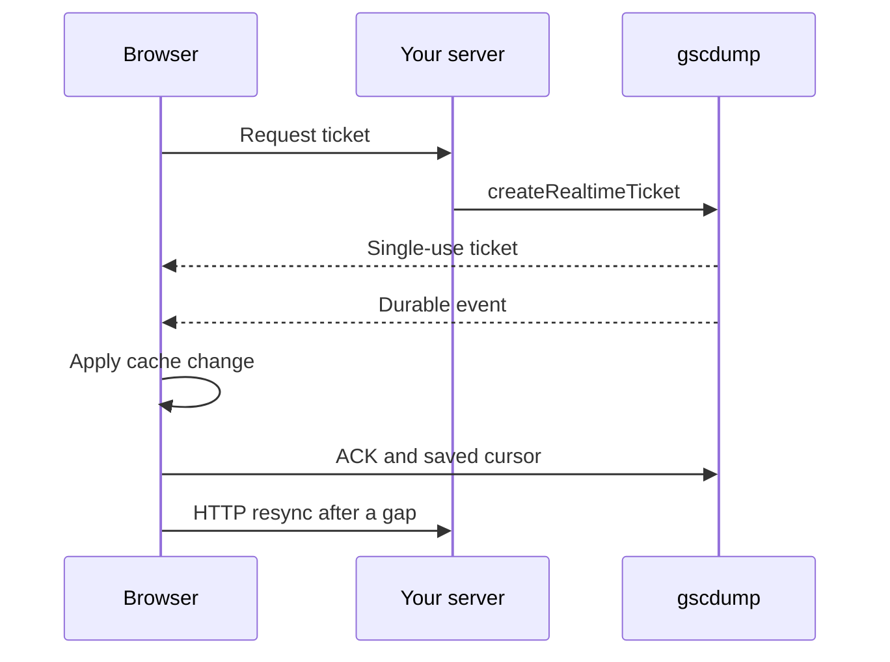

# Show new hosted data in the browser

Realtime tells your app that hosted data changed. Read the current data through HTTP after a change.



## Before you start

Use the [hosted first-result guide](/gscdump-sdk/guides/start/hosted-first-result) to set up a server client. Keep its API key on the server. Register the browser's exact Origin for ticket creation. A ticket expires and can be used once.

## Issue a browser ticket on the server

Your same-origin endpoint calls `createRealtimeTicket({ body: { origin } })` with the browser's registered Origin.

The ticket opens the API key's principal stream. That stream can include several Sites. Give the ticket only to a signed-in user allowed to receive all of them. A check for one Site is insufficient.

Return the ticket response. Keep the API key on the server.

## Connect the browser

```ts
import { createGscdumpRealtimeV1Client } from '@gscdump/sdk/v1'

const realtime = createGscdumpRealtimeV1Client({
  ticketProvider: async () => {
    const response = await fetch('/api/gscdump/realtime/v1/ticket', {
      method: 'POST',
    })
    if (!response.ok)
      throw new Error('Ticket request failed')
    return response.json()
  },
  applyEvent: async (event) => {
    await invalidateAffectedData(event.changes)
  },
  resync: async () => {
    await reloadCurrentData()
  },
})

await realtime.start()
```

`invalidateAffectedData` and `reloadCurrentData` are application functions. The first must finish before the SDK advances its cursor or sends an ACK. The second must fetch authoritative state over HTTP when replay cannot safely catch up.

## Save the cursor

Pass a durable `cursorStore` if the app must resume across page loads. Its `load` and `save` methods must persist the cursor after the change is applied. Without one, the SDK manages only the current session.

## Resync after a gap

If replay is unsafe, clear affected cached state and query [hosted analytics](/gscdump-sdk/guides/read-data/hosted-analytics) again. A notification is not the new analytics payload. The SDK owns reconnect, replay, ACK, and ticket rotation; your callbacks own cache correctness.

## Check reconnect behavior

Drop the connection in development. Confirm that the ticket endpoint issues a new ticket, the app either replays or resyncs, and the UI returns to a current HTTP result. See the [realtime reference](/gscdump-sdk/api/realtime) and [Errors and retry](/gscdump-sdk/guides/operate/errors-and-retry).
