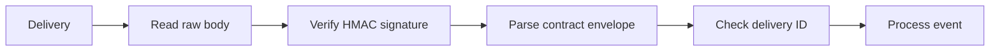

# Receive and verify gscdump webhooks

Use a partner server endpoint for webhook delivery. Verify the signature before acting on an event.



## Before you start

Configure the signing secret for your webhook endpoint. Your endpoint verifies and processes each delivery. The [hosted HTTP contract](/gscdump-sdk/api/hosted-http#api-specifications) defines the installed event schema.

## Read the raw request body

Read `request.text()` before JSON parsing. Verification uses the exact signed bytes. Do not reconstruct JSON or change whitespace first.

## Verify the signature

```ts
import { parseWebhookPayload, WEBHOOK_SIGNATURE_HEADER } from '@gscdump/sdk/webhook'

export async function handleWebhook(request: Request, secret: string) {
  const raw = await request.text()
  const envelope = await parseWebhookPayload(raw, {
    secret,
    signature: request.headers.get(WEBHOOK_SIGNATURE_HEADER),
  })
  return envelope
}
```

`parseWebhookPayload` verifies the signature and parses the contract envelope. An invalid signature rejects the request. If you need separate steps, use `verifyWebhookSignature` on the raw body first.

## Read a typed event

The parsed envelope is discriminated on `event`. Narrow on `event` before you read `data`:

```ts
if (envelope.event === 'user.allowance.notice') {
  const { userId, meter, threshold, used, allowance, period } = envelope.data
  await sendAllowanceNotice({ userId, meter, threshold, used, allowance, period })
}
```

gscdump sends `user.allowance.notice` only to a metered partner, at 80% and 100% of a free allowance. gscdump sends no email to that partner's users, so the partner sends its own notice. `parseWebhookPayload` rejects a notice whose `data` does not match the contract.

## Process repeats and failures

Use `envelope.deliveryId` to deduplicate work. Make writes idempotent. Return success after durable processing or a durable queue accepts the work. A repeated delivery must not repeat a side effect.

## Check delivery

Test with a signed payload from your installed contract or a real test delivery. Check valid signature, changed body, missing signature, duplicate delivery, and handler failure. Log the delivery ID, never the signing secret. See [Errors and retry](/gscdump-sdk/guides/operate/errors-and-retry) for the hosted HTTP path.
